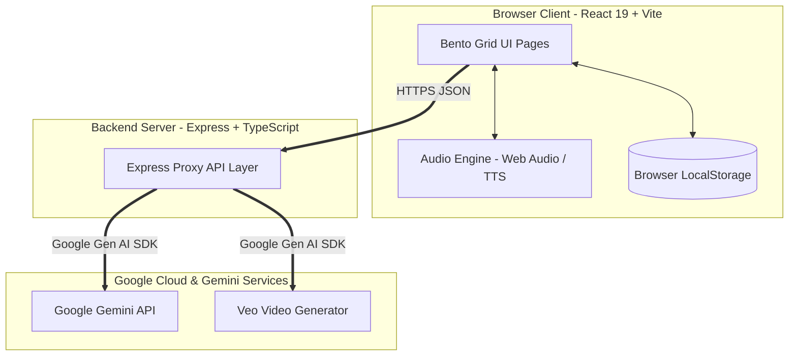
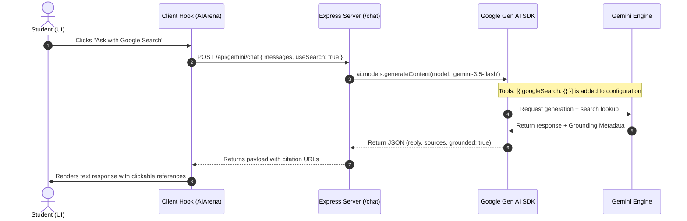

# Visual Architecture & System Design — Simple AI

This document provides a comprehensive overview of the technical architecture, data flows, and component hierarchies that power the **Simple AI** interactive educational web application.

---

## 1. System Overview

Simple AI is designed as a **decoupled full-stack educational portal** that combines a lightweight client-side application with a secure Express server proxy. This architecture protects API credentials and ensures stable, real-time responses.

---

## 2. Core Architectural Layers

### 2.1. Client-Side Presentation Layer (React 19 + Tailwind CSS v4)
- **Framework**: React 19 (Strict Mode) utilizing functional components and hooks for reactive state management.
- **Styling**: Tailwind CSS v4 using modern HSL variable tokens, custom skeuomorphic shadow utility classes, and glassmorphism.
- **Animations**: `motion/react` (Framer Motion) utilizing spring-physics for bouncy layouts, slide-in drawers, and stop-motion style animations for the mascot.
- **Icons**: Lucide React for crisp, scalable vector icons.

### 2.2. Client-Side Audio Synthesis Layer (`audioEngine.ts`)
The application features a unique, zero-bandwidth real-time synthesizer that does not load external mp3/wav files:
- **Procedural Lo-Fi Synthesizer**: Built using HTML5 Web Audio API nodes. Uses a detuned triangle wave oscillator chorus for chords, an LFO for cassette tape wow-and-flutter, white-noise procedural scripts for vinyl crackles, and custom synth nodes for drums (bass kick, hi-hat, brushed snare).
- **Audio Narration Engine**: Integrates HTML5 Web Speech Synthesis (`window.speechSynthesis`). Cleanly parses markdown text, maps regional dialects to optimal local voices (e.g., matching Hyderabadi Urdu to Indian Hindi/Urdu voice profiles), and synchronizes mouth-talk and blinking animations of the virtual mascot.

### 2.3. Server Proxy API Layer (`server.ts`)
An Express-based TypeScript server that encapsulates the `@google/genai` client library. It exposes safe endpoints to the client:
- `/api/health`: Validates server connectivity and verified presence of credentials.
- `/api/gemini/chat`: Orchestrates multi-turn conversation loops with customized system instructions. Handles search grounding and high-thinking settings.
- `/api/gemini/transcribe`: Converts base64 WebM voice recordings into textual prompts.
- `/api/gemini/explain`: Leverages fast, low-cost models for quick metaphors and summaries.
- `/api/gemini/veo/generate` & `/api/gemini/veo/status`: Integrates with Veo video generator for AI-driven visuals.

### 2.4. LLM API Layer (Google Gemini)
- **Chat & Grounding Model**: `gemini-3.5-flash` for fast bilingual dialogue, and `gemini-3.1-pro-preview` for high-depth thinking chains.
- **Transcription Model**: `gemini-3.5-flash` to parse user vocal inputs in multiple languages.
- **Video Model**: `veo-3.1-fast-generate-preview` to generate 720p 16:9 mp4 base64 video previews.

---

## 3. Detailed Data Flow

### 3.1. Gemini Chat with Search Grounding
This sequence describes how the user interacts with Clay using search grounding to fetch live internet info:

---

## 4. Frontend Component Structure

Below is the layout tree of the frontend UI widgets inside the Bento grid:

- [App.tsx](file:///c:/Users/ASUS/Desktop/major%20project/AI_STUDIO/src/App.tsx) — Main layout entry and section animation controller.
  - [FloatingNav.tsx](file:///c:/Users/ASUS/Desktop/major%20project/AI_STUDIO/src/components/FloatingNav.tsx) — Sticky navigation bar with reading time indicator.
  - [AudioNarrationHub.tsx](file:///c:/Users/ASUS/Desktop/major%20project/AI_STUDIO/src/components/AudioNarrationHub.tsx) — Settings control panel for synthesizer (volume, rate, vinyl toggle).
  - [FloatingLanguageBubble.tsx](file:///c:/Users/ASUS/Desktop/major%20project/AI_STUDIO/src/components/FloatingLanguageBubble.tsx) — Real-time language switcher bubble (EN / HYD / TE).
  - [Hero.tsx](file:///c:/Users/ASUS/Desktop/major%20project/AI_STUDIO/src/components/Hero.tsx) — Dynamic intro landing bento card.
  - [WhatIsAI.tsx](file:///c:/Users/ASUS/Desktop/major%20project/AI_STUDIO/src/components/WhatIsAI.tsx) — Definition card with pocket illustrations and key takeaways.
  - [ClayExplainer.tsx](file:///c:/Users/ASUS/Desktop/major%20project/AI_STUDIO/src/components/ClayExplainer.tsx) — Custom animated mascot panel with speech controls.
  - [AIFamilyTree.tsx](file:///c:/Users/ASUS/Desktop/major%20project/AI_STUDIO/src/components/AIFamilyTree.tsx) — Concentric interactive circles mapping AI -> ML -> DL -> GenAI.
  - [GenerativeAI.tsx](file:///c:/Users/ASUS/Desktop/major%20project/AI_STUDIO/src/components/GenerativeAI.tsx) — LLM Token predictor sandbox showing probability distributions.
  - [PromptingAndRAG.tsx](file:///c:/Users/ASUS/Desktop/major%20project/AI_STUDIO/src/components/PromptingAndRAG.tsx) — Live interactive database simulation of RAG workflows.
  - [AIToolsList.tsx](file:///c:/Users/ASUS/Desktop/major%20project/AI_STUDIO/src/components/AIToolsList.tsx) — Directory containing 40+ curated AI tools with one-click copy triggers.
  - [ClosingAndDeeper.tsx](file:///c:/Users/ASUS/Desktop/major%20project/AI_STUDIO/src/components/ClosingAndDeeper.tsx) — The 12-section progressive checklist, progress bar, and glossary.
  - [GoogleClassroomHub.tsx](file:///c:/Users/ASUS/Desktop/major%20project/AI_STUDIO/src/components/GoogleClassroomHub.tsx) — Sync panel to share milestones directly with teachers.
  - [AIArena.tsx](file:///c:/Users/ASUS/Desktop/major%20project/AI_STUDIO/src/components/AIArena.tsx) — Dialogue battlefield comparison widget with transcription support.

---

## 5. Security & State Management Design

### 5.1. Encapsulated State Management
The application manages language global state using a custom React Context:
- [useLanguage.tsx](file:///c:/Users/ASUS/Desktop/major%20project/AI_STUDIO/src/hooks/useLanguage.tsx): Renders translation functions (`t('key')`) and manages active localization codes (`en`, `hyd`, `te`). All translations are housed locally inside this file in a static dictionary object.
- **LocalStorage sync**: The active language, checkbox progress states for all 12 sections, and volume preferences are automatically serialized to and parsed from `window.localStorage` to support persistent session states.

### 5.2. Backend Access Restrictions
- The client does not load the `GEMINI_API_KEY` into the browser bundle. It is loaded strictly on the Express process using `process.env`.
- Any audio transmission payloads and text streams are routed through local REST API routes, avoiding client-side CORS problems and API key leakage.
- High-risk operations (e.g. video files download from Gemini endpoints) are managed entirely inside the Express server memory buffers before being output to the client as base64 payloads.
