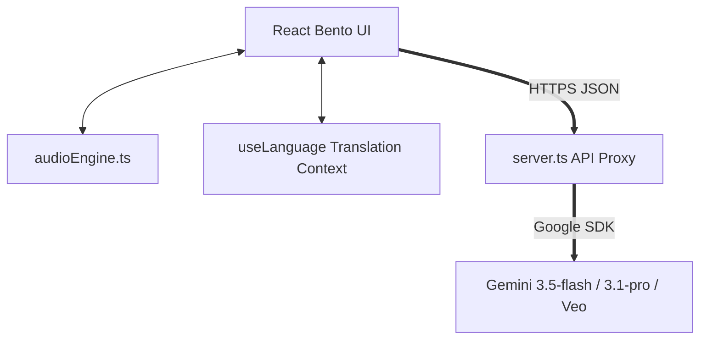

# Master Project Context & Knowledge Base — Simple AI

This document serves as the comprehensive, single-source-of-truth master document for the **Simple AI** educational portal. It consolidates all data, architectural blueprints, product requirements, technical requirements, design systems, roadmap milestones, and development phases.

---

## 1. Project Directory Structure & Key Files

Here is the exact file index of the Simple AI codebase and a summary of each file's purpose:

- [.env.example](file:///c:/Users/ASUS/Desktop/major%20project/AI_STUDIO/.env.example): Blueprint showing required environment variables (`GEMINI_API_KEY`).
- [package.json](file:///c:/Users/ASUS/Desktop/major%20project/AI_STUDIO/package.json): Handles dependencies, project metadata, and compilation pipeline scripts.
- [tsconfig.json](file:///c:/Users/ASUS/Desktop/major%20project/AI_STUDIO/tsconfig.json): TypeScript compilation parameters and type definitions.
- [vite.config.ts](file:///c:/Users/ASUS/Desktop/major%20project/AI_STUDIO/vite.config.ts): Configures client-side builds and bundles React components with CSS templates.
- [index.html](file:///c:/Users/ASUS/Desktop/major%20project/AI_STUDIO/index.html): HTML container and loading template.
- [server.ts](file:///c:/Users/ASUS/Desktop/major%20project/AI_STUDIO/server.ts): Express backend. Sets up standard and secure proxies to connect to the Google Gemini API.
- [firestore.rules](file:///c:/Users/ASUS/Desktop/major%20project/AI_STUDIO/firestore.rules): Security constraints for database integration.
- [BUG_RESOLUTION_REPORT.md](file:///c:/Users/ASUS/Desktop/major%20project/AI_STUDIO/BUG_RESOLUTION_REPORT.md): Historical report details resolved issues and QA checklists.
- [src/main.tsx](file:///c:/Users/ASUS/Desktop/major%20project/AI_STUDIO/src/main.tsx): Client-side mounting script.
- [src/App.tsx](file:///c:/Users/ASUS/Desktop/major%20project/AI_STUDIO/src/App.tsx): Main layout shell and scroll controller.
- [src/types.ts](file:///c:/Users/ASUS/Desktop/major%20project/AI_STUDIO/src/types.ts): Shared TypeScript interfaces for curriculum items and components.
- [src/index.css](file:///c:/Users/ASUS/Desktop/major%20project/AI_STUDIO/src/index.css): Integrates typography imports, custom animation frames, and skeuomorphic styles.
- [src/hooks/useLanguage.tsx](file:///c:/Users/ASUS/Desktop/major%20project/AI_STUDIO/src/hooks/useLanguage.tsx): Controls UI language translation dictionary and active states.
- [src/hooks/useScrollProgress.ts](file:///c:/Users/ASUS/Desktop/major%20project/AI_STUDIO/src/hooks/useScrollProgress.ts): Computes page read percentages.
- [src/lib/audioEngine.ts](file:///c:/Users/ASUS/Desktop/major%20project/AI_STUDIO/src/lib/audioEngine.ts): Web Audio lo-fi music synthesizer and Web Speech synthesis manager.
- **[src/components/](file:///c:/Users/ASUS/Desktop/major%20project/AI_STUDIO/src/components/)**:
  - [ClayLogo.tsx](file:///c:/Users/ASUS/Desktop/major%20project/AI_STUDIO/src/components/ClayLogo.tsx): Vector SVG markup of the stop-motion mascot icon.
  - [FloatingNav.tsx](file:///c:/Users/ASUS/Desktop/major%20project/AI_STUDIO/src/components/FloatingNav.tsx): Glassmorphic header containing sections triggers and progress tracks.
  - [FloatingLanguageBubble.tsx](file:///c:/Users/ASUS/Desktop/major%20project/AI_STUDIO/src/components/FloatingLanguageBubble.tsx): Switcher bubble for toggling languages.
  - [Hero.tsx](file:///c:/Users/ASUS/Desktop/major%20project/AI_STUDIO/src/components/Hero.tsx): Layout introducing terms and value propositions.
  - [WhatIsAI.tsx](file:///c:/Users/ASUS/Desktop/major%20project/AI_STUDIO/src/components/WhatIsAI.tsx): First curriculum layer defining algorithms and pattern-matching.
  - [ClayExplainer.tsx](file:///c:/Users/ASUS/Desktop/major%20project/AI_STUDIO/src/components/ClayExplainer.tsx): Animation cycles and audio voice outputs player for the mascot.
  - [AIFamilyTree.tsx](file:///c:/Users/ASUS/Desktop/major%20project/AI_STUDIO/src/components/AIFamilyTree.tsx): Nesting maps visualizing AI, ML, Deep Learning, and Generative AI.
  - [GenerativeAI.tsx](file:///c:/Users/ASUS/Desktop/major%20project/AI_STUDIO/src/components/GenerativeAI.tsx): Next-word probability weight generator sandbox.
  - [PromptingAndRAG.tsx](file:///c:/Users/ASUS/Desktop/major%20project/AI_STUDIO/src/components/PromptingAndRAG.tsx): Interactive simulation steps of database search matching prompts.
  - [AIToolsList.tsx](file:///c:/Users/ASUS/Desktop/major%20project/AI_STUDIO/src/components/AIToolsList.tsx): List containing 40+ curated free tools with copy action triggers.
  - [ClosingAndDeeper.tsx](file:///c:/Users/ASUS/Desktop/major%20project/AI_STUDIO/src/components/ClosingAndDeeper.tsx): The 12-section progressive checklist, progress bar, and glossary.
  - [CheckYourKnowledge.tsx](file:///c:/Users/ASUS/Desktop/major%20project/AI_STUDIO/src/components/CheckYourKnowledge.tsx): Interactive quizzes.
  - [GoogleClassroomHub.tsx](file:///c:/Users/ASUS/Desktop/major%20project/AI_STUDIO/src/components/GoogleClassroomHub.tsx): Interface for sharing milestone certificates.
  - [AIArena.tsx](file:///c:/Users/ASUS/Desktop/major%20project/AI_STUDIO/src/components/AIArena.tsx): Duel comparison zone between models with speech input.

---

## 2. Product Requirements Document (PRD) Summary

### 2.1. Value Proposition
Modern artificial intelligence guides are often either too flat (passive articles) or too confusing (mathematics-heavy tutorials). Simple AI offers a tactical middle ground: a highly visual, tactile, and sensory-friendly guide explaining AI through:
1. **Clear Analogies**: Breaking down complex structures into simple real-world metaphors (e.g. learning what a dog is).
2. **Tactile Interactive Sandboxes**: Letting users build sentences using LLM word probability matrices and step through database-backed RAG lookups in real-time.
3. **Bilingual Localization**: Toggling in real-time between English and Romanized Hyderabadi Urdu to make AI approachable and humorous.
4. **Calming Sound Design**: A procedural lo-fi synthesizer and Speech Synthesis narration to support focus.

### 2.2. Core Features
- **Progressive Curriculum**: Concept layers mapping basic definition -> core machine learning structures -> prompting/RAG sandboxes -> collapsible glossary checks.
- **Masot Clay**: Interactive stop-motion mascot that blinks, looked around, and narrates lessons with synchronized lip-movement.
- **Progress Persistence**: Checklist marks and sound configurations automatically saved to the browser's `localStorage` for session persistence.
- **Regional Dialects**: Native, warm, Romanized Urdu translation assets supporting terms like "Miya", "yaaron", and "phekna".

---

## 3. Technical Requirements Document (TRD) Summary

### 3.1. Requirements & Compatibility
- **Runtime**: Node.js v18+; TypeScript ~5.8+; NPM v9+.
- **Browser Requirements**: Modern HTML5 browsers with full Web Audio API and Speech Synthesis API features.
- **Secrets Protocol**: API keys must remain strictly on backend environments and never be exposed in compile-time client scripts.

### 3.2. Backend Routes Summary
1. `/api/health` [GET]: Returns service connectivity parameters.
2. `/api/gemini/chat` [POST]: multi-turn assistant utilizing model `gemini-3.5-flash` or `gemini-3.1-pro-preview` with search grounding and thinking level configurations.
3. `/api/gemini/transcribe` [POST]: transcribes WebM audio segments.
4. `/api/gemini/veo/generate` & `veo/status` [POST/GET]: video generator queue interfaces.
5. `/api/gemini/explain` [POST]: fast explanation endpoint using `gemini-3.1-flash-lite`.

### 3.3. Sound Parameter Settings
- **Chord Progression**: Detuned triangle oscillators routed to low-pass filters at 650Hz.
- **Crackle Generation**: Continuous procedural noise buffers with randomized dust pops.
- **Drums**: Lofi drums running at 70 BPM.
- **Narrations**: Clean markdown parse, Indian Urdu/Hindi voice fallback routing, and speaking rates set between `0.94` and `0.96` for high vocal clarity.

---

## 4. Visual Architecture & System Design



### 4.1. Key Technical Layers
- **UI Presentation Layer**: React 19 single-page grid utilizing Framer Motion animation layouts.
- **Localization Engine**: Custom React Context hook utilizing key mappings translating English keys (`what_is_ai`) to regional templates.
- **Backend Service Proxy**: Handles Express request bodies, constructs content history matrices for Gemini sessions, fetches citations, downloads video streams, and sends output JSON.

---

## 5. Design System & Styling Tokens

All styling tokens are declared in [index.css](file:///c:/Users/ASUS/Desktop/major%20project/AI_STUDIO/src/index.css):

### 5.1. Color Tokens
- `cream`: `#F5F2ED` — Base background (editorial paper).
- `sand`: `#EBE7E0` — Sidebar borders and shadows.
- `amber`: `#d97706` — Primary buttons and active highlights.
- `slate`: `#475569` — Muted text.
- `charcoal`: `#2D2D2D` — High contrast headers and body copy.

### 5.2. Skeuomorphic Component Classes
- **Elevated Bento Boxes (`.skeuo-raised`)**:
  ```css
  box-shadow: 8px 8px 16px #dcd9d4, -8px -8px 16px #ffffff;
  ```
- **Engraved Wells (`.skeuo-pressed`)**:
  ```css
  box-shadow: inset 4px 4px 8px #dcd9d4, inset -4px -4px 8px #ffffff;
  ```
- **Translucent Overlays (`.glass-panel`)**:
  ```css
  background: rgba(255, 255, 255, 0.45);
  backdrop-filter: blur(12px);
  ```

---

## 6. Learning Curriculum & Syllabus

The curriculum is structured as a vertical progressive path divided into 12 distinct learning units:

1. **Section 01: The Absolute Basics** — Explains algorithms, data, and pattern-matching.
2. **Section 02: Traditional vs. AI Programming** — Contrasts hardcoded logic rules with ML training examples.
3. **Section 03: The AI Family Tree** — Explores nested diagrams mapping umbrella fields.
4. **Section 04: Machine Learning** — Breaks down parameters, loss equations, and epoch iterations.
5. **Section 05: Deep Learning** — Connects artificial neurons with human synapses.
6. **Section 06: Generative AI** — Introduces LLMs and probability distribution.
7. **Section 07: Large Language Models (LLMs)** — Visualizes attention windows, context sizes, and hallucinations.
8. **Section 08: Chatbots vs. Models** — Differentiates UI wrappers from model engines.
9. **Section 09: Prompt Engineering** — Covers Zero-shot, Few-shot, and Chain of Thought instructions.
10. **Section 10: RAG (Retrieval-Augmented Generation)** — Simulates vector database queries.
11. **Section 11: Real-World Use Cases** — Shows recommendation feeds, computer vision, and predictive typing.
12. **Section 12: Advanced Frontiers & Ethics** — Focuses on autonomous agents, safety guardrails, and explainability.

---

## 7. Development Phases History

- **Phase 1: Inception & Setup**: Established stack, configured Vite/Tailwind, and built the Express proxy layout.
- **Phase 2: Curricular Mapping**: Authored all 12 glossary text contents in English and Romanized Urdu, and configured translation contexts.
- **Phase 3: Interactive Sandbox widgets**: Developed the Token Predictor, the RAG simulation database visualizer, and local storage state persistence.
- **Phase 4: API proxy layer**: Implemented Gemini Chat, Search Grounding, Thinking Level structures, base64 WebM audio transcription, and Veo operations.
- **Phase 5: Audio Synthesis layer**: Created the browser-based Web Audio lo-fi player and Speech Synthesis voices controller.
- **Phase 6: QA Polish**: Resolved icon references (`BookOpen` load bug), completed lint validations, and configured build commands.

---

## 8. Run & Deploy Scripts

- **Install Dependencies**: `npm install`
- **Start Dev Environment**: `npm run dev` (Runs server on port `3000`)
- **Type Check Validation**: `npm run lint`
- **Build static assets & bundle server**: `npm run build`
- **Clean builds**: `npm run clean`
